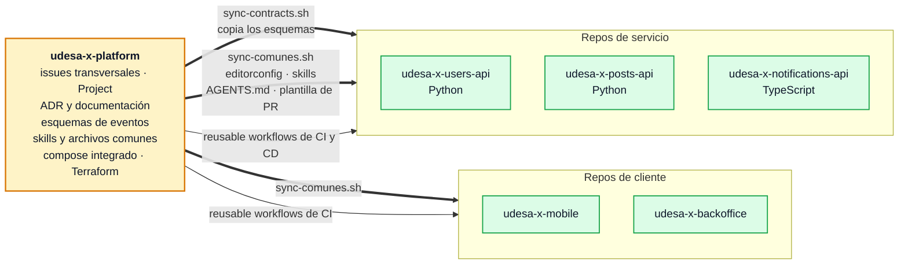
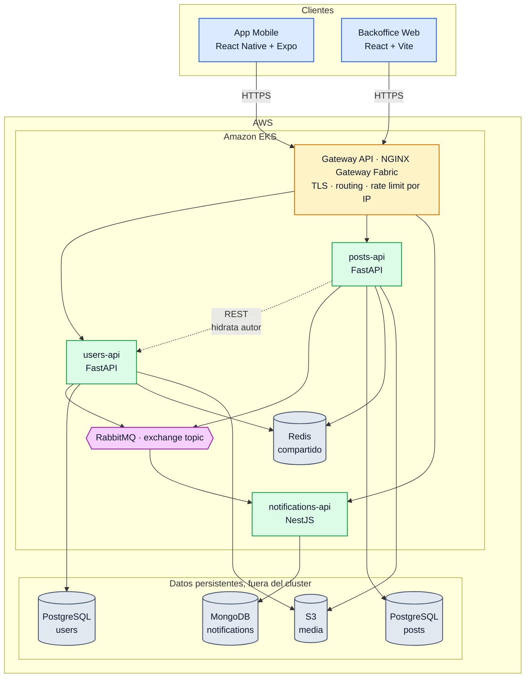
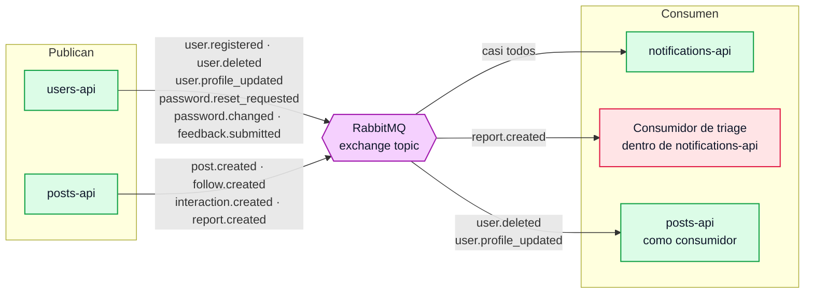
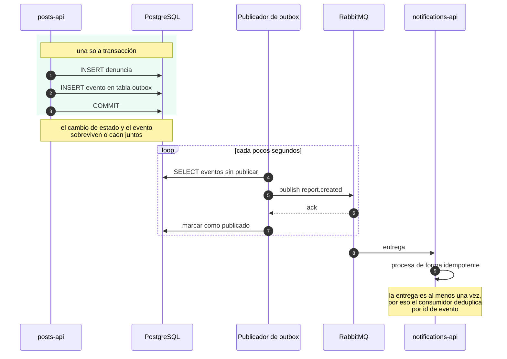
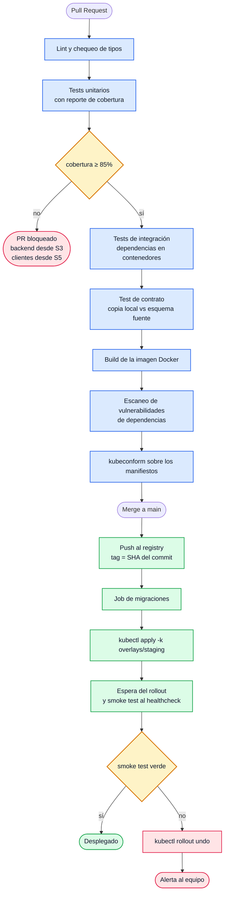
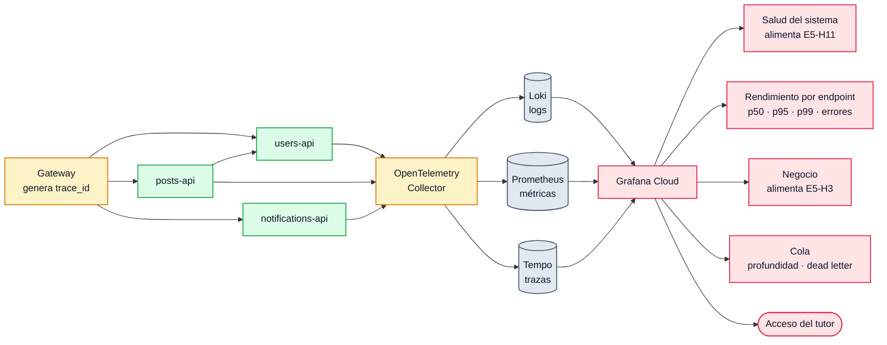
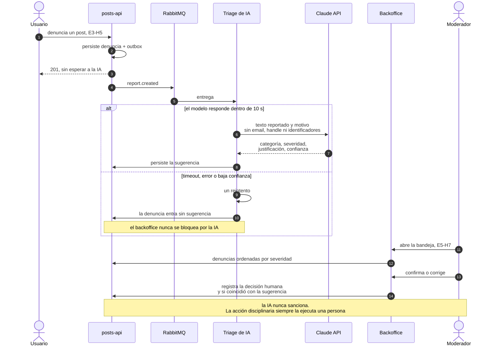

# Arquitectura de referencia de UdeSA-X

## Estado de este documento

Propuesta de arquitectura. Dos decisiones las respondió el tutor por Slack el 2026-08-19, una tercera se apoya en una mención suya al pasar y falta confirmarla, y la cuarta la impone el calendario de la materia:

1. **Un repositorio por servicio.** Cada repo lleva sus tests y coverage, su pipeline de CI, sus scripts, su Docker y compose de desarrollo, y sus manifiestos de Kubernetes.
2. **Kubernetes** como plataforma de despliegue. Sin cerrar: el tutor lo nombró al listar qué lleva cada repo de servicio, no como respuesta a una pregunta sobre despliegue. Hay que confirmarlo antes de escribir el primer manifiesto, en S5.
3. **Los contratos de eventos se copian** entre repos. Recomendación textual del tutor: copiar en lugar de armar librerías, para no pelear con empaquetado y publicación.
4. **AWS con EKS** como proveedor de nube. El cronograma dedica la clase del 21 de septiembre a deployar en EKS y la entrega intermedia del 28 de septiembre exige el sistema "desplegado en AWS". Sigue abierta como `D21` hasta el 20 de septiembre: hasta no haber cursado esa clase el equipo no puede justificar la elección, y ECS con Fargate es el plan B.

El resto sigue sujeto a validación en S1. Cada decisión relevante debe quedar como ADR en el repositorio de plataforma.

**Decisiones del equipo del 2026-08-20**, incorporadas a todo el documento:

1. **Python es el stack principal del backend.** `users-api` y `posts-api` van en Python con FastAPI, y `notifications-api` en TypeScript con NestJS. La consigna pide que el backend no esté en una única tecnología y no dice cuál lleva más peso: conviene que el servicio más grande quede en el stack que el equipo maneja mejor.
2. **No hay `media-api`.** La subida de archivos se resuelve dentro de `users-api` y `posts-api`, con el módulo de streaming escrito una vez y copiado. Son seis repositorios.

**Revisión del stack del 2026-08-20.** Cada pieza se contrastó contra fuentes primarias y las conclusiones están incorporadas a este documento. La más importante: **el NGINX Ingress Controller está archivado desde marzo de 2026**, así que la entrada del cluster va con Gateway API.

El criterio que gobierna el documento: **elegir lo más simple que cumpla el requisito**. Cuatro personas en quince sprints semanales no pueden pagar el costo operativo de una arquitectura sofisticada, y con un repo por servicio ese costo se multiplica por servicio.

## Cómo se cumple cada requisito de la consigna

| Requisito                                   | Cómo se cumple                                                            |
| ------------------------------------------- | ------------------------------------------------------------------------- |
| App principal exclusivamente mobile         | React Native con Expo                                                     |
| Backoffice como aplicación web              | React + Vite, SPA                                                         |
| Arquitectura de microservicios              | 3 servicios backend, un repositorio cada uno, despliegue independiente    |
| Al menos dos tipos de base de datos         | PostgreSQL (relacional), MongoDB (documental), Redis (clave-valor)      |
| Backend en más de una tecnología            | Python con FastAPI en `users` y `posts`, TypeScript con NestJS en `notifications` |
| Desplegada en entorno productivo en la nube | Kubernetes gestionado                                                     |
| Cada microservicio contenedorizado          | Dockerfile en cada repo, imágenes versionadas en el registry              |
| Buenas prácticas de seguridad, OWASP Top 10 | Sección "Seguridad"                                                       |
| Enfoque iterativo e incremental             | 15 sprints semanales alineados a las clases, ver `PLANIFICACION.md`       |
| Testing unitario, integración y estrés      | Sección "Estrategia de pruebas"                                           |
| Cobertura mínima del 85% ejecutada en CI    | Gate en el workflow de cada repo. Backend desde S3, clientes desde S5     |
| Pipeline de CD con GitHub Actions           | Build, push al registry y `kubectl apply` por servicio                    |
| Observabilidad con métricas, logs y trazas  | OpenTelemetry hacia Grafana Cloud                                         |
| Rate limiting en al menos un microservicio  | Gateway por IP, `users-api` y `posts-api` por usuario                     |
| Al menos una cola entre dos microservicios  | RabbitMQ, `posts-api` y `users-api` publican, `notifications-api` consume |
| Buena experiencia de usuario                | Sistema de diseño compartido, revisión de UX en S13                       |

## Mapa de repositorios

Seis repositorios en `tds-g3-2s2026`, todos creados y **públicos** desde el 2026-08-21. La visibilidad no es cosmética: en el plan gratuito, GitHub habilita ramas protegidas, reglas de repositorio, secrets de organización y minutos de Actions ilimitados solo en repos públicos.

| Repositorio                 | Estado    | Contenido                                          | Stack                      |
| --------------------------- | --------- | -------------------------------------------------- | -------------------------- |
| `udesa-x-mobile`            | existe    | App mobile                                         | React Native + Expo        |
| `udesa-x-backoffice`        | existe    | Backoffice web                                     | React + Vite               |
| `udesa-x-users-api`         | existe    | Identidad, perfiles, administradores, avatares     | FastAPI + Python           |
| `udesa-x-posts-api`         | existe    | Contenido, grafo social, feed, búsqueda, imágenes  | FastAPI + Python           |
| `udesa-x-notifications-api` | existe    | Push, centro in-app, emails, triage de IA          | NestJS + TypeScript        |
| `udesa-x-platform`          | existe    | Gestión, documentación, infraestructura compartida | Kustomize, Terraform, docs |

**Por qué dos servicios en Python y uno en TypeScript.** La consigna exige que el backend no esté en una única tecnología y no dice más que eso. Dado el margen, conviene que el peso caiga donde el equipo es más rápido: `posts-api` concentra casi la mitad de los puntos del sistema y ponerlo en el stack menos conocido era pagar ese costo en la parte más grande. `notifications-api` es el candidato natural para el segundo lenguaje porque es el más acotado: consume la cola, habla con FCM y con el proveedor de email, y no tiene lógica de dominio propia. Además Node tiene el mejor soporte de clientes de FCM. Y como mobile y backoffice son React, el equipo toca TypeScript igual todos los días.

**Por qué desapareció `media-api`.** Era el servicio más flojo del mapa: sin base de datos propia, era glue de I/O hacia S3, y arrastraba un repositorio entero con su CI, su gate de cobertura del 85%, sus manifiestos y su Dockerfile. Llegar al 85% en un servicio de streaming obliga a mockear S3 pesadamente, que es trabajo real a cambio de una separación que el proyecto no necesita.

La subida ahora vive donde vive el dueño del dato: `users-api` maneja avatares y portadas, `posts-api` maneja imágenes de post, los dos contra el mismo bucket con prefijos distintos. El módulo de subida por streams con validación por magic numbers se escribe una vez en `users-api` y se copia a `posts-api`, que es el mismo criterio que el tutor dio para los contratos de eventos y ahora es literal porque los dos servicios están en Python. Desaparece además la llamada cruzada entre servicios para subir un archivo, y el evento `media.orphaned`: cada servicio limpia su propio storage en la misma operación que borra el registro.

### Qué contiene cada repositorio de servicio

Estructura idéntica en los tres, para que moverse entre repos sea trivial. La plantilla vive en `udesa-x-platform/templates/repo-servicio/`:

```text
udesa-x-<servicio>/
├── AGENTS.md               # mapa, reglas y checks; bloque común sincronizado
├── .editorconfig           # sincronizado desde platform
├── .agents/skills/         # sincronizado desde platform
├── src/
├── tests/
│   ├── unit/
│   └── integration/
├── contracts/              # esquemas de eventos, copiados desde platform
│   └── events/
├── docker/
│   ├── Dockerfile
│   └── docker-compose.dev.yml     # el servicio y sus dependencias
├── k8s/
│   ├── base/                      # deployment, service, configmap, hpa
│   └── overlays/
│       ├── staging/
│       └── production/
├── scripts/
│   ├── test.sh
│   ├── lint.sh
│   └── migrate.sh
├── .github/
│   ├── workflows/                 # ci.yml y cd.yml, tres líneas cada uno
│   ├── copilot-instructions.md    # sincronizado desde platform
│   └── PULL_REQUEST_TEMPLATE.md   # sincronizado desde platform
└── README.md
```

### Qué contiene `udesa-x-platform`

Es el repositorio central del proyecto, no un servicio. Concentra lo que no pertenece a ningún servicio en particular:

```text
udesa-x-platform/
├── AGENTS.md                # fuente del bloque común de todos los repos
├── .editorconfig            # fuente
├── .agents/skills/          # fuente: explicar-implementacion, revisar-pr
├── docs/
│   ├── CONSIGNA.md
│   ├── PLANIFICACION.md
│   ├── ARQUITECTURA.md
│   ├── CONVENCIONES.md      # reglas del equipo y guidelines del tutor
│   ├── adr/                 # registro de decisiones de arquitectura
│   ├── eventos/             # esquemas fuente de los contratos
│   ├── actas/               # reuniones con el tutor
│   └── retros/
├── k8s/
│   ├── namespaces/
│   ├── gateway/             # Gateway API, NGINX Gateway Fabric y reglas
│   ├── rabbitmq/
│   └── observability/
├── terraform/               # cluster, bases gestionadas, registry, DNS
├── compose/
│   └── docker-compose.full.yml    # sistema completo con imágenes publicadas
├── templates/
│   └── repo-servicio/       # plantilla de repositorio, incluye AGENTS.md
├── scripts/
│   ├── sync-contracts.sh    # copia los esquemas a los repos de servicio
│   └── sync-comunes.sh      # copia editorconfig, skills, plantillas y bloque común
└── .github/
    ├── workflows/           # reusable workflows de CI y CD
    ├── copilot-instructions.md
    └── PULL_REQUEST_TEMPLATE.md
```

Acá viven las issues **transversales**: infraestructura, documentación y decisiones. Las issues de historias de usuario viven en el repositorio donde vive su código, no acá. El tutor lo pidió explícitamente: toda rama lleva su issue asociada, y el milestone semanal se cierra con el tag del repo que efectivamente se tocó. El Project de la organización toma issues de los seis repos, así que el tablero funciona igual.

Los milestones se crean solo en los repos que tienen trabajo esa semana. Quince milestones por seis repos serían noventa y no aportarían nada; el campo Iteration del Project ya da la vista de los quince sprints.

### Cómo se relacionan los seis repositorios



Cada repo lleva sus propias issues y sus propios milestones semanales. `udesa-x-platform` solo concentra lo transversal y lo que se sincroniza hacia los demás.

## Vista general



Lo que el diagrama deja explícito y conviene no perder de vista: **las bases persistentes están fuera del cluster**, mientras que Redis corre adentro porque sus datos son efímeros y perderlos no cuesta nada, la única llamada sincrónica entre servicios es `posts-api` hidratando datos de autor contra `users-api`, todo lo demás cruza por la cola, y **los dos servicios de Python escriben al mismo bucket de S3 con prefijos distintos** (`avatars/` y `posts/`), cada uno dueño de lo suyo.

Lo que deliberadamente **no** dibuja, para que se entienda: los eventos concretos que viajan por la cola están en el diagrama de "Comunicación entre servicios", la telemetría en el de "Observabilidad", y los proveedores externos que consume `notifications-api` son FCM para push, el proveedor de email y la Claude API para el triage de denuncias.

### Correspondencia con la nube

| Componente                  | Servicio de AWS                                 | A confirmar                                                                                                              |
| --------------------------- | ----------------------------------------------- | ------------------------------------------------------------------------------------------------------------------------ |
| Cluster                     | Amazon EKS                                      | Abierto hasta el 20 de septiembre, `D21`                                                                                 |
| PostgreSQL de users y posts | RDS for PostgreSQL, una instancia con dos bases | Tamaño de instancia según créditos, S2                                                                                   |
| MongoDB                     | MongoDB Atlas en capa gratuita                  | DocumentDB solo si hay créditos: cuesta varias veces más                                                                 |
| Redis                       | Dentro del cluster                              | Los datos son efímeros: revocación, rate limit y caché. Autohospedado, no ElastiCache: el volumen del proyecto no justifica el gestionado |
| Almacenamiento de media     | S3 con bucket privado y URLs firmadas           | Cerrado                                                                                                                  |
| Registry de imágenes        | GitHub Container Registry                       | Cerrado, no se usa ECR para no atar el CI a AWS                                                                          |
| DNS y certificados          | cert-manager con Let's Encrypt sobre el Gateway | Cerrado, no se usa ACM                                                                                                   |
| Región                      | `us-east-1`                                     | Cerrado. `sa-east-1` sale 35% a 45% más caro en cómputo y transferencia, y el control plane cuesta lo mismo              |

Mantener el registry y los certificados fuera de AWS es deliberado: si el plan B de `ECS con Fargate` se activa, o si se acaban los créditos, lo único que hay que rehacer es el despliegue, no el pipeline entero.

## Servicios

Versiones fijadas en la revisión del 2026-08-20. Se fijan una vez y no se persiguen releases durante el cuatrimestre.

| Stack | Elección | Nota |
| ----- | -------- | ---- |
| Python, dos servicios | Python 3.13, FastAPI, SQLAlchemy 2 async con asyncpg, Alembic, uv, Ruff y pytest | Es el stack principal del backend: `users-api` y `posts-api`. **No** usar 3.14 con free-threading: el ecosistema todavía no tiene wheels estables y un servicio web es I/O-bound, así que no hay nada que ganar |
| TypeScript, un servicio | Node 24 LTS, NestJS 11 con adaptador Fastify, Vitest | Solo `notifications-api`. Node 24 tiene soporte hasta abril de 2028 y el cliente de FCM es el más maduro del ecosistema. Sin ORM: MongoDB con el driver oficial, que alcanza para documentos de forma variable |
| Servidor ASGI | Uvicorn con **un worker por pod** | La escala la da el HPA, no `--workers`. Con varios workers adentro del pod, uno colgado no lo detecta ningún probe |
| Imágenes | `python:3.13-slim` y `node:24-slim`, multi-stage, arm64 | Distroless recién en S13, cuando el pipeline esté aburrido: sin shell, depurar un pod cuesta el doble |
| Subida de archivos | `python-multipart` con streaming a S3 vía `aioboto3`, validación por magic numbers, miniaturas con Pillow | Escrito una vez en `users-api`, copiado a `posts-api` |

### `users-api`

**FastAPI sobre Python. PostgreSQL, Redis y S3.**

Es el primer servicio en arrancar y el que desbloquea a todos los demás. Concentra todo lo que gira alrededor de la identidad.

- Registro, verificación de email, login, logout.
- Emisión y revocación de JWT, con lista de revocación en Redis y TTL igual a la expiración del token.
- Lockout por intentos fallidos.
- Recuperación y cambio de contraseña.
- Registro de aceptación de términos.
- Perfiles: display name, biografía, avatar, portada, fecha de registro.
- Preferencias: visibilidad, idioma, presencia, tema.
- Administradores, roles y contraseñas temporales.
- Última conexión.
- Subida de avatar y portada a S3, con streaming, validación por magic numbers y miniaturas.

Cubre E1-H1 a H14, más E5-H1, E5-H2 y E5-H9.

**Por qué identidad y perfil juntos:** el handle, el display name y el avatar aparecen en cada post, cada notificación y cada listado. Separarlos genera una llamada cruzada en casi toda lectura del sistema.

### `posts-api`

**FastAPI sobre Python. PostgreSQL, Redis y S3.**

Concentra contenido, grafo social, feed y búsqueda. Es el servicio más grande del sistema.

- Posts, respuestas, citas, eliminación lógica.
- Likes y retweets con idempotencia garantizada.
- Hashtags, menciones y posts guardados.
- Relaciones de seguimiento, solicitudes pendientes, contadores.
- Bloqueos, silenciados y listas personalizadas.
- Feed cronológico paginado por cursor.
- Búsqueda de posts y usuarios.
- Trending topics sobre ventana de 24 horas.
- Denuncias e invitaciones.
- Subida de imágenes de post a S3, con el mismo módulo copiado desde `users-api`.

Cubre E2-H1 a H14 y E3-H1 a H10 salvo mensajes directos.

**Por qué el grafo y el contenido juntos:** E3-H1 CA.4 exige actualizar contadores de forma "consistente y atómica". Con el grafo en otro servicio eso obliga a una saga distribuida con compensaciones para lo que en una sola base es una transacción. Además casi toda autorización de lectura de un post depende del grafo: si la cuenta es protegida, si la sigo, si me bloqueó, si la silencié.

**Por qué el feed también:** un feed cronológico se arma de posts y follows, que ya están acá. Separarlo obligaría a mantener una proyección del grafo sincronizada por eventos, que es trabajo real y una fuente de inconsistencias, a cambio de una separación que el volumen del proyecto no necesita.

**Búsqueda:** PostgreSQL con `pg_trgm` y `tsvector`. Cubre coincidencias parciales y case-insensitive, que es lo que pide E2-H10 CA.1, sin agregar Elasticsearch al cluster.

**Trending:** consulta de agregación sobre hashtags de las últimas 24 horas, cacheada en Redis con TTL de 15 minutos, que es exactamente lo que exige E2-H11 CA.3.

### `notifications-api`

**NestJS sobre TypeScript. MongoDB.** Es el único servicio en TypeScript y es deliberado: acotado, sin lógica de dominio propia, y con el cliente de FCM más maduro del ecosistema.

Es el consumidor principal de la cola y el que justifica la segunda base de datos.

- Consume eventos y decide qué notificar.
- Consulta preferencias antes de enviar, como exige E4-H5 CA.2.
- Envía push por FCM, gestiona y depura device tokens.
- Persiste el historial in-app, paginado y con borrado lógico.
- Envía todos los emails salientes: verificación, recuperación, cambio de contraseña, feedback, alerta de servicio caído.

Cubre E4-H1 a H5, más el envío de emails de E1-H1, H5, H11, H13 y E5-H11.

MongoDB encaja porque las notificaciones tienen forma variable según el tipo, se escriben mucho, se leen paginadas por usuario y se archivan.

### Subida de archivos: módulo copiado, no servicio

La subida vive en el servicio dueño del dato:

| Qué | Dónde | Prefijo en S3 |
| --- | --- | --- |
| Avatar y portada | `users-api` | `avatars/`, `covers/` |
| Imágenes de post | `posts-api` | `posts/` |

El módulo se escribe una vez en `users-api` y se copia a `posts-api`. Es el mismo criterio
que el tutor dio para los contratos de eventos, y acá es literal porque los dos servicios
están en Python.

Qué hace el módulo, que es lo que exigen los criterios de aceptación:

- Recibe por stream, sin cargar el archivo en memoria: E1-H8 CA.7.
- Valida el tipo real por magic numbers, no por extensión: E1-H8 CA.3 y E2-H7 CA.3.
- Valida tamaño según destino: 5 MB avatar, 10 MB portada, 1 MB por imagen de post.
- Genera miniaturas en AVIF con Pillow.
- Elimina el archivo anterior al reemplazar, en la misma operación que actualiza el
  registro: E1-H8 CA.4.

Ese último punto es la ganancia concreta de haber sacado el servicio. Antes hacía falta un
evento `media.orphaned` y un consumidor que limpiara asincrónicamente, con la ventana de
inconsistencia que eso implica. Ahora borrar el archivo viejo y actualizar la fila del perfil
ocurren en el mismo caso de uso.

**Decisión pendiente, con fecha en S6.** La práctica recomendada hoy es una URL prefirmada de
S3 para que el cliente suba directo, sin que el servicio proxee los bytes. Es más barato y
más robusto, pero entonces el servidor nunca ve el archivo y ni E1-H8 CA.7 ni CA.3 se cumplen
como están redactados. Se arranca con el diseño de arriba, que cumple la consigna al pie de
la letra, y se evalúa el cambio en S13 si sobra tiempo.

## Comunicación entre servicios

### Sincrónica

REST sobre HTTP con JSON, solo cuando la respuesta se necesita dentro del request. Se limita al mínimo:

- El Gateway a cualquier servicio.
- `posts-api` a `users-api` para hidratar datos de autor.
- `backoffice` a los healthchecks de los tres servicios, para E5-H11.

Toda llamada sincrónica lleva timeout, reintento con backoff y comportamiento definido ante fallo del destino. En Kubernetes esto se apoya en los probes: un servicio sin `readinessProbe` en verde no recibe tráfico.

### Asincrónica

RabbitMQ 4.x desplegado en el cluster, con exchange de tipo topic. Elegido sobre Kafka porque es mucho más simple de operar, tiene interfaz de administración que sirve para demostrar el requisito, y tiene clientes maduros en Node y en Python. NATS JetStream es operativamente más simple, pero su interfaz de administración no iguala al management plugin de RabbitMQ, y acá el requisito es demostrar la cola.

**Las colas se declaran `quorum` explícitamente**, junto con la dead letter queue vía `x-dead-letter-exchange`. RabbitMQ 4.0 removió las classic mirrored queues: si nadie declara el tipo, se termina con colas sin replicación sin que nadie lo note.

**Cuándo entra.** La cola se levanta en **S4**, no antes, porque hasta que existe `notifications-api` el único consumidor posible sería el propio publicador y no cumpliría el requisito de la consigna de comunicar dos microservicios. En S2 el email de verificación del registro se manda sincrónico desde `users-api`, detrás de una interfaz, y pasa a la cola en S4 sin tocar el caso de uso.

| Evento                     | Publica      | Consume                               |
| -------------------------- | ------------ | ------------------------------------- |
| `user.registered`          | users        | notifications (email de verificación) |
| `user.deleted`             | users        | posts, notifications                  |
| `user.profile_updated`     | users        | posts                                 |
| `password.reset_requested` | users        | notifications                         |
| `password.changed`         | users        | notifications                         |
| `feedback.submitted`       | users        | notifications                         |
| `post.created`             | posts        | notifications (menciones)             |
| `follow.created`           | posts        | notifications                         |
| `interaction.created`      | posts        | notifications                         |
| `report.created`           | posts        | notifications, triage de IA           |



`posts-api` aparece dos veces a propósito: publica y consume. Necesita reaccionar a `user.deleted` y `user.profile_updated` para mantener consistente el autor denormalizado en cada post.

**Patrón outbox:** los servicios que publican escriben el evento en una tabla `outbox` dentro de la misma transacción que el cambio de estado, y un proceso aparte lo publica. Sin esto, un crash entre el commit y el publish deja el sistema inconsistente en silencio.

El outbox es el mecanismo que hace confiable la publicación, y no se entiende de la descripción:



Sin outbox, un crash entre el `COMMIT` y el `publish` deja una denuncia persistida que nadie va a notificar, y el sistema queda inconsistente en silencio. Con outbox el peor caso es publicar dos veces, que el consumidor idempotente absorbe.

Tres detalles de implementación que no son opcionales:

1. El publicador lee con `SELECT ... FOR UPDATE SKIP LOCKED`, para que dos réplicas no tomen el mismo evento.
2. Un trigger con `pg_notify` despierta al publicador apenas se inserta la fila. El polling periódico queda como red de seguridad si se cae la conexión de `LISTEN`. Esto baja la latencia a casi cero sin agregar CDC ni Debezium, que exigirían Kafka Connect en el cluster.
3. La deduplicación del consumidor es una tabla con el id del evento como clave primaria, y el insert va **dentro de la misma transacción** que el efecto de negocio. Así el at-least-once del broker se vuelve exactly-once desde la perspectiva del negocio, sin librerías.

### Contratos de eventos: copiados, no empaquetados

Por indicación del tutor, los esquemas se copian en lugar de publicarse como librería. El esquema fuente vive en `udesa-x-platform/docs/eventos/`, y `scripts/sync-contracts.sh` lo copia a `contracts/events/` de cada repo de servicio.

El riesgo real de copiar no es duplicar, es **divergir en silencio**. Se mitiga sin empaquetar nada: cada servicio tiene un test de contrato que valida su copia local contra el esquema, y el CI de `udesa-x-platform` verifica que las copias en los tres repos de servicio coincidan con la fuente. Si alguien edita su copia sin propagar, el pipeline lo detecta. Es la mitad del beneficio de una librería compartida sin nada del costo de publicación.

## Bases de datos

| Base       | Tipo        | Servicios     | Por qué                                                                                     |
| ---------- | ----------- | ------------- | ------------------------------------------------------------------------------------------- |
| PostgreSQL | Relacional  | users, posts  | Integridad referencial, transacciones, contadores atómicos, búsqueda de texto con `pg_trgm` |
| MongoDB    | Documental  | notifications | Documentos de forma variable por tipo, escritura intensiva, lectura paginada por usuario    |
| Redis      | Clave-valor | users, posts  | Revocación de JWT, contadores de rate limit, presencia con TTL, caché de trending           |

**PostgreSQL 18**, que en RDS está disponible en la minor 18.4. Trae `uuidv7()` como función nativa, y esa es la clave primaria de `posts`: mantiene los inserts append-mostly en el índice, da cursor cronológico implícito y no expone IDs adivinables en un feed público, que es lo que pasaría con `bigserial`. Hay que fijarlo antes de la primera migración, después cuesta mucho más.

**MongoDB Atlas M0 topea en 100 operaciones por segundo**, además de 0.5 GB y 500 conexiones. Las pruebas de carga de S6 y S12 contra `notifications-api` van a chocar contra ese techo y no contra el sistema: hay que acotar el alcance de esa prueba o correrla contra una instancia local.

Cada servicio es dueño exclusivo de su esquema y **ningún servicio consulta la base de otro**. Esto no es purismo: es lo que hace que el desacoplamiento sea real y no solo estructura de carpetas.

Las bases persistentes corren **fuera del cluster**, como servicios gestionados. Operar PostgreSQL con estado dentro de Kubernetes agrega volúmenes persistentes, backups y failover, que es una materia entera y no aporta nada a la nota. **Redis es la excepción y corre adentro**: guarda revocación de JWT, contadores de rate limit y caché, todo efímero y con TTL, así que perderlo ante un reinicio no rompe nada y no justifica pagar un servicio gestionado. La correspondencia concreta con los servicios de AWS está en la tabla de la sección "Vista general".

Migraciones versionadas y ejecutadas como Job de Kubernetes antes del rollout: **Alembic en los dos servicios de Python**. `notifications-api` usa MongoDB y no lleva migraciones de esquema. Una sola herramienta de migraciones en todo el proyecto es una consecuencia directa de haber concentrado el backend relacional en Python, y ahorra mantener dos flujos distintos.

El Job toma un `pg_advisory_lock` durante toda la migración, para que dos rollouts en carrera no migren a la vez. Los cambios van en expand y contract, en deploys separados: primero lo aditivo, el `DROP` o el `NOT NULL` en un deploy posterior. El rollback es forward-only: las down-migrations casi nunca se prueban y fallan justo cuando se las necesita.

## Aplicaciones cliente

### Mobile

**React Native con Expo.**

| Aspecto            | Elección                                                        |
| ------------------ | --------------------------------------------------------------- |
| SDK                | Expo 57, con React Native 0.86 y React 19.2                     |
| Navegación         | Expo Router                                                     |
| Estado de servidor | TanStack Query v5, con scroll infinito nativo                   |
| Estado global      | Zustand                                                         |
| JWT                | `expo-secure-store`                                             |
| Push               | `expo-notifications` sobre FCM                                  |
| Tests              | Jest y React Native Testing Library **14**                      |
| E2E                | **Maestro**                                                     |
| Distribución       | EAS Build, APK para Android y TestFlight si hay cuenta de Apple |

Dos cosas que hay que fijar antes del primer test, porque cambiarlas después obliga a reescribir: **RNTL 14** pasó todas las APIs core a asíncronas, y arrancar en la 13 significa migrar a mitad de cuatrimestre. Y **Maestro, no Detox**: Detox lleva meses sin commits y tiene un bug abierto que rompe la sincronización con la New Architecture, que desde el SDK 55 es el único modo que existe.

Expo resuelve tres cosas que el proyecto necesita y que en React Native puro cuestan semanas: build en la nube sin Xcode ni Android Studio, distribución al tutor y configuración de push.

### Backoffice web

**React 19 con Vite 8 y TypeScript.** SPA, sin renderizado en servidor: un panel interno no necesita SEO.

| Aspecto            | Elección                                     |
| ------------------ | -------------------------------------------- |
| Estado de servidor | TanStack Query v5                            |
| Ruteo              | TanStack Router                              |
| Componentes        | Mantine                                      |
| Tablas             | TanStack Table                               |
| Gráficos           | Recharts, para E5-H3                         |
| Tests              | Vitest 4 y Testing Library                   |
| Compilador         | React Compiler activado desde S1              |

Mantine sobre shadcn porque trae formularios y gráficos en el mismo monorepo con versionado en lockstep, y con quince semanas el pegamento entre librerías es justamente lo que consume sprints. El React Compiler es estable desde octubre de 2025 y elimina una clase entera de bug para quien está aprendiendo React: `useMemo` y `useCallback` mal puestos.

**Los clientes REST se generan, no se escriben a mano.** Los tres servicios ya exponen OpenAPI, y con Orval cada repo cliente genera tipos, cliente y hooks de TanStack Query contra ese esquema, y commitea lo generado. Un cambio de contrato aparece como diff en el PR. Es el mismo criterio que la decisión A3 del tutor para los eventos: nada que publicar, la divergencia se ve en la revisión.

## Infraestructura y despliegue

### Kubernetes

| Componente   | Elección                                      | Notas                                                                                             |
| ------------ | --------------------------------------------- | ------------------------------------------------------------------------------------------------- |
| Cluster      | Amazon EKS 1.36 con Auto Mode                 | Impuesto por el cronograma de la cátedra y por la entrega intermedia, que exige despliegue en AWS |
| Nodos        | 2 × t4g.medium en Spot, subredes públicas     | Sin NAT gateway, con security groups cerrados y acceso por SSM. Imágenes arm64                    |
| Manifiestos  | Kustomize                                     | `base` más overlays de staging y producción. Más simple que Helm sin plantillas complejas         |
| Entrada      | **Gateway API con NGINX Gateway Fabric**      | TLS, routing por path, rate limiting por IP. Reemplaza a ingress-nginx, archivado                  |
| TLS          | cert-manager con Let's Encrypt                | Certificados automáticos y renovados                                                              |
| Secretos     | **SOPS con age**, desencriptado en Actions    | Cero pods en el cluster, y sobrevive a destruir y recrear el cluster                              |
| Registry     | GitHub Container Registry                     | Integrado con Actions, sin configuración extra                                                    |
| Identidad    | EKS Pod Identity                              | Lo recomendado hoy sobre IRSA: sin proveedor OIDC y el rol se reutiliza entre clusters            |
| Autoescalado | HPA por servicio, más **KEDA** para la cola   | KEDA escala `notifications-api` por profundidad de cola, con `minReplicaCount: 0`                  |

**Por qué cambia el ingress.** El repositorio `kubernetes/ingress-nginx` está archivado desde el 24 de marzo de 2026 y su README dice textualmente que quien no lo esté usando ya no debería desplegarlo. No va a haber más parches de seguridad, y antes de cerrar acumulaba seis CVEs en cuatro meses. Lo traicionero es que no se rompe: funcionaría perfecto los quince sprints. NGINX Gateway Fabric conserva el motor NGINX; TLS y routing no pierden nada, y el rate limiting por IP sigue siendo gratis pero pasa a una CRD `RateLimitPolicy` en `v1alpha1`, así que hay que fijar la versión del chart. La API `Ingress` de Kubernetes no está deprecada: lo que murió es ese controller.

**Por qué SOPS y no Sealed Secrets.** Sealed Secrets está sano, pero su clave privada vive solo dentro del cluster, y la palanca de ahorro principal es destruir y recrear el cluster entre sprints. Cada recreación dejaría todos los secretos del repositorio irrecuperables.

**Por qué KEDA.** El HPA por CPU no puede demostrar lo que interesa. KEDA permite mostrar cero pods, publicar mensajes en la cola y verlos aparecer. Dos advertencias que ahorran horas: nunca definir un HPA propio sobre el mismo Deployment que un `ScaledObject`, y el vhost de RabbitMQ hay que URL-encodearlo.

### Costo: los números reales

Verificados el 2026-08-20 contra la Price List API, en `us-east-1`:

| Configuración                                              | USD/mes    |
| ---------------------------------------------------------- | ---------- |
| Mínima: 2 × t4g.small Spot, sin NAT, sin balanceador        | **94,36**  |
| Razonable: 2 × t4g.medium on-demand, 1 ALB, sin NAT         | **165,93** |
| Razonable con NAT gateway                                   | 195,13     |

De agosto a diciembre son entre 425 y 878 USD según la configuración. **En la configuración mínima el control plane es el 77% del costo**: sin él, el resto serían 21 USD. No se puede pausar, y un cluster con el nodegroup en cero cuesta 73 USD exactos.

Palancas, por impacto:

1. **Destruir y recrear el cluster entre sprints: hasta -165 USD/mes.** Con `make up` y `make down` sobre Terraform, recrear tarda de 12 a 15 minutos. Prendido 40 horas al mes en lugar de 730, la configuración razonable baja a unos 9 USD. Es la palanca que hace viable el proyecto, y la razón por la que los secretos van con SOPS y no con Sealed Secrets.
2. Nodegroup a cero entre demos: -49 USD/mes.
3. Un solo ALB compartido en vez de uno por servicio: -71 USD/mes.
4. Spot: -57% en cómputo. Graviton sobre x86: -19%.

**Dos trampas que hay que desactivar el primer día.** Los clusters de EKS se crean con `upgradePolicy=EXTENDED`: si el cluster cae en soporte extendido, AWS no bloquea nada, empieza a cobrar seis veces más. Se corrige con `aws eks update-cluster-config --upgrade-policy supportType=STANDARD`. Y hay que evitar Kubernetes 1.34, cuyo soporte estándar termina el 2 de diciembre de 2026, justo sobre el cierre del cuatrimestre.

**El free tier de 12 meses de AWS no existe más** desde el 15 de julio de 2025. Las cuentas nuevas reciben hasta 200 USD de crédito y **se cierran solas a los 6 meses o al agotar el crédito, lo que pase primero**, que es menos que el cuatrimestre. Por eso las cuentas se abren con **plan pago**: mismo crédito, sin cierre. Cuatro personas con una cuenta cada una son 800 USD, rotando quién hostea. Dos avisos: si la cuenta se une a una AWS Organization los créditos expiran de inmediato, y el GitHub Student Pack **no** incluye créditos de AWS. Definir presupuesto y alertas es `T-23`, que se adelanta a S1.

**Plan B, con fecha de decisión el 20 de septiembre:** si el spike de EKS que arranca el 7 de septiembre no llega a servir tráfico para la entrega intermedia, se despliega en **ECS con Fargate**. Cumple el requisito de microservicios contenedorizados en un entorno productivo de AWS sin exigir Kubernetes, a costa de perder el alineamiento con las clases de Cloud Computing. Además es cuatro veces más barato: entre 34 y 44 USD mensuales con Fargate ARM y Spot, contra 147 de EKS. El control plane de EKS, solo, cuesta más que todo el cómputo Fargate del mismo workload. Decidirlo tarde es peor que decidirlo mal. App Runner **no** es una alternativa: está cerrado a clientes nuevos.

**Para la semana del 28 de septiembre:** pasar el nodegroup a on-demand el lunes anterior y dejarlo prendido hasta la entrega. Una interrupción de Spot durante la defensa no vale los 28 USD que ahorra.

### Entornos

| Entorno                   | Cómo se levanta                                                              | Para qué                                      |
| ------------------------- | ---------------------------------------------------------------------------- | --------------------------------------------- |
| Desarrollo de un servicio | `docker compose -f docker/docker-compose.dev.yml up` en su repo              | Trabajar en ese servicio con sus dependencias |
| Sistema completo local    | `docker compose -f compose/docker-compose.full.yml up` en `udesa-x-platform` | E2E, demos, onboarding                        |
| Staging                   | Automático al mergear a `main` de cualquier repo de servicio                 | Aceptación de historias, pruebas de carga     |
| Producción                | Manual con aprobación                                                        | Entrega final y defensa                       |

El compose completo usa **imágenes publicadas en el registry**, no builds locales. Así levantar el sistema entero no requiere clonar los seis repos: se clona `udesa-x-platform` y listo. Es la respuesta al problema que introduce el polirepo.

### Pipeline por repositorio de servicio

Los seis repos usan el mismo par de workflows, que viven **una sola vez** en `udesa-x-platform/.github/workflows/` como reusable workflows. Cada repo de servicio queda con tres líneas:

```yaml
jobs:
  ci:
    uses: tds-g3-2s2026/udesa-x-platform/.github/workflows/ci-node.yml@main
    secrets: inherit
```

No se copian, a diferencia de los contratos de eventos: copiar los contratos fue una indicación explícita del tutor, y para los workflows GitHub ya resuelve el problema de fábrica, en el plan gratuito. Elimina la clase de bug "el CI de un repo quedó atrás y nadie se dio cuenta", que con seis repos y quince semanas es cuestión de tiempo. Los *required workflows* a nivel organización sí exigen Enterprise, pero no hacen falta: alcanza con branch protection por repo.

**CI**, en cada Pull Request:

1. Lint y chequeo de tipos.
2. Tests unitarios con reporte de cobertura.
3. **Gate: falla si la cobertura baja del 85%.** Activo desde S3 en backend y desde S5 en los clientes; antes de esa fecha el paso reporta pero no bloquea.
4. Tests de integración contra dependencias en contenedores.
5. Test de contrato: la copia local de los esquemas coincide con la fuente.
6. Build de la imagen Docker.
7. Escaneo de vulnerabilidades de dependencias.
8. Validación de los manifiestos con `kubeconform`.

**CD**, en cada merge a `main`, autenticando contra AWS con **OIDC**, sin claves de larga vida en los secrets del repo:

1. Build y push de la imagen al registry, etiquetada con el SHA del commit.
2. Job de migraciones si el servicio tiene base.
3. `kubectl apply -k k8s/overlays/staging`.
4. Espera del rollout y smoke test contra el healthcheck.
5. `kubectl rollout undo` automático si el smoke test falla.



El único camino a producción pasa por el gate de cobertura. Se activa en S3 para los tres servicios backend y en S5 para mobile y backoffice.

**Todas las actions se fijan por SHA de commit, nunca por tag.** No es paranoia: la action `aquasecurity/trivy-action` fue comprometida en un ataque de cadena de suministro el 19 de marzo de 2026. Es A03 del OWASP Top 10:2025 aplicado al propio pipeline, y cuesta una línea por action.

Cada servicio se despliega solo, sin tocar a los demás. Ese es el desacoplamiento que pide la consigna, y con un repo por servicio queda demostrado sin discusión posible.

## Observabilidad

**OpenTelemetry** en los tres servicios, exportando a **Grafana Cloud**.

| Señal    | Herramienta | Qué se recolecta                                                |
| -------- | ----------- | --------------------------------------------------------------- |
| Logs     | Loki        | Logs estructurados en JSON con `trace_id`, `user_id`, `service` |
| Métricas | Prometheus  | Latencia, tasa de error, throughput, saturación por endpoint    |
| Trazas   | Tempo       | Traza distribuida completa de cada request entre servicios      |

Grafana Cloud se elige por su capa gratuita: 14 días de retención, 10.000 series activas, 50 GB de logs, 50 GB de trazas y 500 VUh de k6 por mes, que además cubre las pruebas de carga de S6 y S12 sin cuenta aparte. Autohospedar el stack LGTM consumiría varios GB de RAM que compiten con las apps, más upgrades y backups.

**El free tier son 3 usuarios y el equipo más el tutor son 5.** La consigna exige que el tutor acceda, así que hay que resolverlo antes de S6, no en S10: dashboards públicos o snapshots, que no consumen asiento, es la salida más barata y probablemente suficiente porque el tutor necesita ver, no administrar. Si la cátedra exige cuenta propia con acceso completo, la alternativa es Honeycomb, que da usuarios ilimitados.

Tres detalles de implementación: el Collector va en modo gateway (un Deployment con una o dos réplicas), no como DaemonSet ni sidecar; se exporta por OTLP sobre HTTP con protobuf, para no configurar HTTP/2 en el Gateway; y la señal de **logs sigue experimental en el SDK de JavaScript**, así que hay que fijar la versión exacta o rompe en cualquier actualización. En Python, OpenTelemetry se inicializa **antes** que structlog, o el `trace_id` no aparece en los logs.

Dashboards mínimos:

1. Salud del sistema: healthcheck y estado de los pods de cada servicio, alimenta E5-H11.
2. Rendimiento por endpoint: p50, p95, p99, tasa de error.
3. Negocio: registros, posts, interacciones por día, alimenta E5-H3.
4. Cola: profundidad, tasa de consumo, mensajes en la dead letter queue.



El `trace_id` nace en el Gateway, viaja por header y aparece en todos los logs. Es lo que convierte depurar un flujo distribuido en algo posible en vez de un ejercicio de adivinación.

## Seguridad

### Mapeo contra OWASP Top 10:2025

Se mapea contra la edición **2025**, vigente desde enero de 2026. Cambió bastante respecto de 2021: la configuración incorrecta subió al segundo puesto, componentes vulnerables se expandió a toda la cadena de suministro, SSRF desapareció como categoría propia y se absorbió en A01, y apareció A10, manejo de condiciones excepcionales.

| Riesgo                                        | Cómo se mitiga                                                                                                                                                                                                                    |
| --------------------------------------------- | ----------------------------------------------------------------------------------------------------------------------------------------------------------------------------------------------------------------------------------- |
| A01 Control de acceso roto                    | Autorización en cada servicio, no solo en el Gateway. Verificación de propiedad en E2-H3 CA.1. 404 en lugar de 403 ante bloqueo, como exige E3-H4 CA.4. Tests específicos de autorización. Ninguna URL provista por el usuario se consume desde el servidor, que es el SSRF ahora absorbido acá. |
| A02 Configuración incorrecta                  | CORS restringido. Cabeceras de seguridad en el Gateway. NetworkPolicies entre pods. Pod Security Admission `restricted`. Imágenes base mínimas, contenedores sin root.                                                             |
| A03 Fallas de la cadena de suministro         | Dependabot en los seis repos. Escaneo de imágenes con Trivy. **Actions fijadas por SHA**. SBOM con syft y attestations de build en el pipeline.                                                                                   |
| A04 Fallas criptográficas                     | Argon2id con `m=19456, t=2, p=1`. TLS en todo tránsito. SOPS con age, nunca secretos en claro en el repo.                                                                                                                          |
| A05 Inyección                                 | ORM con consultas parametrizadas. Sanitización de HTML en E1-H6 CA.4 y E2-H1 CA.3. Validación de esquema en cada endpoint.                                                                                                        |
| A06 Diseño inseguro                           | Threat model en S7. Rate limiting. Tokens de un solo uso con expiración. Mensajes genéricos en E1-H2 CA.3 y E1-H5 CA.4 para evitar enumeración.                                                                                    |
| A07 Fallas de autenticación                   | Lockout tras intentos fallidos. Tokens de vida corta con refresh y rotación. Revocación en cambio de contraseña, exigida por E1-H5 CA.7 y E1-H13 CA.3.                                                                            |
| A08 Integridad de software y datos            | Imágenes etiquetadas por SHA, nunca `latest`. Migraciones versionadas. Patrón outbox.                                                                                                                                             |
| A09 Fallas de registro y alertas              | Logs estructurados, trazas, alertas. Auditoría de acciones administrativas en E5-H6.                                                                                                                                              |
| A10 Manejo de condiciones excepcionales       | Categoría nueva. Timeout y comportamiento definido ante fallo de cada dependencia. Sin stack traces al cliente: errores en formato RFC 7807. El triage de IA degrada sin bloquear el backoffice.                                   |

El nivel L1 de OWASP ASVS 5.0 se usa como checklist manual antes de cada entrega grande.

### Manejo de tokens

- Access token JWT de 15 minutos, con `sub`, `role` y `jti`. Algoritmo asimétrico (EdDSA o ES256), nunca HS256 compartido ni `alg:none`.
- Refresh token de 7 días, en `expo-secure-store` en mobile, **con rotación en cada uso y detección de reuso**: si aparece un refresh token ya usado, se asume comprometido y se revoca la familia entera de sesiones del usuario.
- Revocación por `jti` en Redis, guardando el hash SHA-256 del token y no el token crudo, con TTL igual a la vida restante.
- Cambio de contraseña, bloqueo por admin y cuenta en revisión revocan todas las sesiones.

**Decisión abierta.** El JWT se elige normalmente para evitar el round-trip al almacén de sesiones, y este diseño lo hace igual para consultar la lista de revocación. Sin ese beneficio, un token opaco con la sesión en Redis es estrictamente más simple: revoca instantáneo, sin manejo de claves de firma ni superficie de ataque de parsers. Las dos son defendibles y decide el equipo antes de S3.

### Rate limiting

| Ámbito                     | Dónde         | Límite                                     |
| -------------------------- | ------------- | ------------------------------------------ |
| Por IP                     | Gateway       | Global, primera línea de defensa           |
| Login por cuenta           | users-api     | 5 intentos, bloqueo de 15 min (E1-H2 CA.2) |
| Login de admin             | users-api     | 3 intentos, bloqueo de 30 min (E5-H2 CA.3) |
| Recuperación de contraseña | users-api     | Limitado por correo (E1-H5 CA.8)           |
| Creación de posts          | posts-api     | 30 por hora por usuario (E2-H1 CA.5)       |
| Solicitudes de seguimiento | posts-api     | 50 por hora por usuario (E3-H1 CA.5)       |
| Feedback                   | users-api     | 2 por hora por usuario (E1-H11 CA.4)       |
| Invitaciones               | posts-api     | 10 links por día por usuario (E3-H9 CA.3)  |

El middleware se implementa una vez en Python con contadores en Redis, y se copia entre `users-api` y `posts-api` como el módulo de subida: `limits` sobre FastAPI, en vez de escribir scripts Lua a mano. `notifications-api` no expone endpoints públicos, así que no lo necesita.

Un matiz que conviene documentar y que suma en la defensa: el rate limit del Gateway es local a cada pod de NGINX, así que con tres réplicas el límite efectivo se triplica. Se corre una sola réplica para la demo y se explica por qué. La alternativa realmente distribuida exige Redis más el servicio de rate limit de Envoy, que son más piezas de las que este proyecto necesita.

## Estrategia de pruebas

| Nivel       | Alcance                                             | Herramientas                      | Dónde corre                  |
| ----------- | --------------------------------------------------- | --------------------------------- | ---------------------------- |
| Unitarias   | Lógica de dominio, validaciones, hooks, componentes | pytest, Vitest, RNTL 14           | CI de cada repo              |
| Integración | Endpoints contra base y cola reales en contenedores | pytest, Testcontainers, Supertest | CI de cada repo              |
| Contrato    | La copia local de esquemas coincide con la fuente   | Validación de JSON Schema         | CI de cada repo              |
| E2E         | Flujos críticos de punta a punta                    | Maestro, Playwright               | `udesa-x-platform`, nocturno |
| Carga       | Los seis flujos con SLO definido                    | k6                                | `udesa-x-platform`, S6 y S12 |

Los E2E y las pruebas de carga viven en `udesa-x-platform` porque cruzan servicios y ningún repo de servicio es su dueño natural.

### Cobertura del 85%

El umbral es 85% en todos los repos y se verifica en el CI de cada uno. Lo que cambia es **cuándo se enciende el gate**:

| Repos | Gate activo desde | Por qué |
| --- | --- | --- |
| `users-api`, `posts-api`, `notifications-api` | **S3**, 7 de septiembre | Es la fecha a partir de la cual la cátedra exige que todo el código que se sube esté testeado, y en S3 los servicios ya tienen forma. |
| `mobile`, `backoffice` | **S5**, 21 de septiembre | En S3 la app mobile tiene navegación y sesión y poco más, y el equipo vio React recién el 24 de agosto. Un gate que bloquea PRs al 85% sobre React Native en la semana 3 se termina desactivando, y un gate desactivado no vuelve. |

Cuatro consecuencias que hay que aceptar desde el primer día:

1. **El gate se enciende antes de que la cobertura caiga**, no después. Subir de 40% a 85% al final es una tarea que nadie termina.
2. **Entre S3 y S5 los repos de cliente reportan cobertura sin bloquear.** El número se mira en la review del lunes: si en S4 no subió, el problema se trata ahí y no el 21 de septiembre.
3. **En mobile se prioriza la lógica**: hooks, servicios de API, reducers, validaciones y transformaciones. Los componentes visuales se cubren con tests de render e interacción.
4. **El porcentaje no mide si el test verifica algo**: se llega a 85% con tests sin un solo assert. La contramedida barata es correr mutation testing (mutmut en Python, Stryker en TypeScript) sobre los módulos críticos (autenticación, autorización, contadores) una vez por sprint, nunca como gate de PR porque es lento. La skill `revisar-pr` chequea explícitamente que los tests tengan asserts.

### Flujos críticos de E2E

1. Registro, verificación por email y primer login.
2. Crear post con imagen y verlo en el feed de un seguidor.
3. Seguir a cuenta protegida, aprobar la solicitud, ver sus posts.
4. Bloquear a un usuario y verificar que desaparece del feed y de la búsqueda.
5. Denunciar, resolver desde el backoffice, verificar la auditoría.
6. Recibir una notificación push y abrir la app en el destino correcto.

## Integración de Inteligencia Artificial

El triage de denuncias vive como un consumidor de la cola dentro de `notifications-api`, que ya es el servicio consumidor por diseño. Crear un repositorio nuevo para una única llamada a una API externa sería complejidad sin beneficio, y con polirepo ese costo es aún mayor. Es el mismo criterio que llevó a descartar `media-api`.



| Aspecto             | Decisión                                                                                            |
| ------------------- | --------------------------------------------------------------------------------------------------- |
| Modelo              | `claude-haiku-4-5`, 1 USD por millón de tokens de entrada y 5 por millón de salida                  |
| Salida              | Esquema JSON forzado con salida estructurada, para que siempre parsee                               |
| Datos enviados      | Solo el texto reportado y el motivo. Nunca email, handle ni identificadores                         |
| Timeout             | 10 segundos. Si vence, la denuncia entra sin sugerencia                                             |
| Fallo del proveedor | Se registra, se reintenta una vez, la denuncia queda sin sugerencia. El backoffice nunca se bloquea |
| Clave de API        | Sealed Secret en el cluster, jamás en el repo ni en el cliente                                      |
| Costo estimado      | Centavos para el volumen del proyecto entero                                                        |

**Restricciones no negociables:** la IA nunca sanciona, el moderador confirma o corrige, se registra la decisión humana junto a la sugerencia, y se minimizan los datos enviados al proveedor.

## Decisiones de arquitectura

Confirmadas por el tutor el 2026-08-19, para registrar como ADR:

| #   | Decisión                   | Resolución                                                                                   |
| --- | -------------------------- | -------------------------------------------------------------------------------------------- |
| A1  | Estructura de repositorios | **Un repositorio por servicio.** Cada uno con sus tests, coverage, CI, Docker, compose y k8s |
| A2  | Plataforma de despliegue   | **Kubernetes** gestionado                                                                    |
| A3  | Contratos de eventos       | **Copiados** entre repos, no empaquetados. Con test de contrato para detectar divergencia    |
| A4  | Proveedor de nube          | **AWS con EKS**, impuesto por el cronograma de la cátedra                                    |

Pendientes de definir en S1:

| #   | Decisión                         | Propuesta                                                                              |
| --- | -------------------------------- | -------------------------------------------------------------------------------------- |
| A4b | Cantidad de servicios backend    | **3: users, posts, notifications.** `media` se descartó y su función vive como módulo copiado en los dos servicios de Python |
| A5  | Lenguajes backend                | Exactamente dos. **Python con FastAPI en `users` y `posts`, TypeScript con NestJS en `notifications`** |
| A6  | Framework mobile                 | React Native con Expo                                                                  |
| A7  | Feed dentro de posts-api         | Sí, para evitar mantener una proyección del grafo sincronizada por eventos             |
| A8  | Motor de búsqueda                | PostgreSQL con `pg_trgm`, sin Elasticsearch                                            |
| A9  | Broker de mensajes               | RabbitMQ sobre Kafka, por simplicidad operativa                                        |
| A10 | Plan B de despliegue             | ECS con Fargate si EKS no llega. Se decide el 20 de septiembre                         |
| A11 | Herramienta de manifiestos       | Kustomize sobre Helm                                                                   |
| A12 | Bases dentro o fuera del cluster | Las persistentes fuera, como servicios gestionados. Redis adentro: sus datos son efímeros |
| A13 | Observabilidad                   | Grafana Cloud, por el requisito de acceso del tutor                                    |
| A14 | Proveedor de email               | Resend o Brevo, con dominio verificado en S1, porque el registro de S2 depende de esto |
| A15 | Push en iOS                      | Depende de la cuenta de Apple Developer                                                |
| A16 | Presupuesto de AWS               | Quién paga y si hay créditos. Cuentas con plan pago, y decidir si el cluster se destruye entre sprints |

### Nuevas, de la revisión del stack del 2026-08-20

| #   | Decisión                    | Estado                                                                                                                    |
| --- | --------------------------- | ------------------------------------------------------------------------------------------------------------------------- |
| A17 | Controller de entrada       | **Cerrada por obsolescencia**: Gateway API con NGINX Gateway Fabric. ingress-nginx está archivado desde marzo de 2026     |
| A18 | Gestión de secretos         | **SOPS con age** en vez de Sealed Secrets, cuya clave muere al recrear el cluster                                          |
| A19 | Clave primaria de contenido | **UUIDv7 nativo de PostgreSQL 18.** Hay que fijarlo antes de la primera migración                                         |
| A20 | Motor clave-valor           | **Redis.** Revertida el 2026-08-23 en la revisión del PR #6 de `users-api`. La versión anterior elegía Valkey por precio en ElastiCache, que no aplica porque se autohospeda, y por licencia, que perdió peso desde que Redis 8 ofrece AGPLv3. Queda que Redis es más estándar y el equipo lo conoce |
| A21 | Plantillas de CI            | **Reusable workflows**, no copiadas. Los contratos de eventos se siguen copiando, porque eso lo pidió el tutor            |
| A22 | Manejo de tokens            | **Abierta, decide el equipo antes de S3**: JWT con lista de revocación, o token opaco con sesión en Redis                |
| A23 | Subida de media             | **Abierta, se decide en S6**: stream por el servicio, que cumple los criterios literales, o URL prefirmada con validación posterior. Ya no involucra un servicio aparte |
| A24 | Acceso del tutor a Grafana  | **Abierta, se decide antes de S6**: el free tier son 3 asientos y el equipo más el tutor son 5                            |

### Nuevas, de la revisión del equipo del 2026-08-20

| #   | Decisión                    | Estado                                                                                                                    |
| --- | --------------------------- | ------------------------------------------------------------------------------------------------------------------------- |
| A25 | Reparto de lenguajes        | **Cerrada: Python es el stack principal del backend.** `users-api` y `posts-api` en FastAPI, `notifications-api` en NestJS. La consigna solo exige más de una tecnología, no fija el peso de cada una |
| A26 | `media-api` como servicio   | **Cerrada: se descarta.** La subida vive en el servicio dueño del dato, con el módulo copiado entre `users-api` y `posts-api`. Seis repositorios en vez de siete |
| A27 | Ubicación de las issues     | **Cerrada por el tutor: una issue por repo, junto a su código.** `udesa-x-platform` solo lleva las transversales. Ver `CONVENCIONES.md` |
| A28 | Activación del gate de cobertura | **Cerrada: escalonado.** 85% desde S3 en los tres servicios backend, desde S5 en mobile y backoffice |
| A29 | AGENTS.md y skills          | **Cerrada: obligatorios desde S1.** Bloque común sincronizado desde platform, skills versionadas en el repo. Ver `CONVENCIONES.md` |
| A30 | Sincronización de comunes   | **Cerrada:** `repo-file-sync-action` para archivos comunes, según recomendó el tutor, y reusable workflows para el CI. Plantear la diferencia en la reunión |
