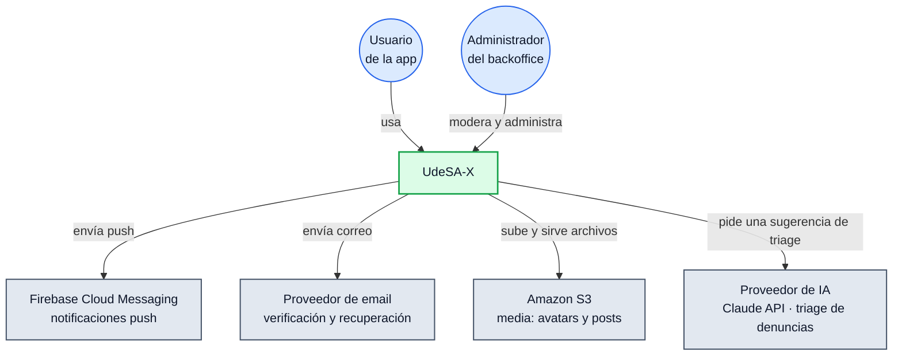
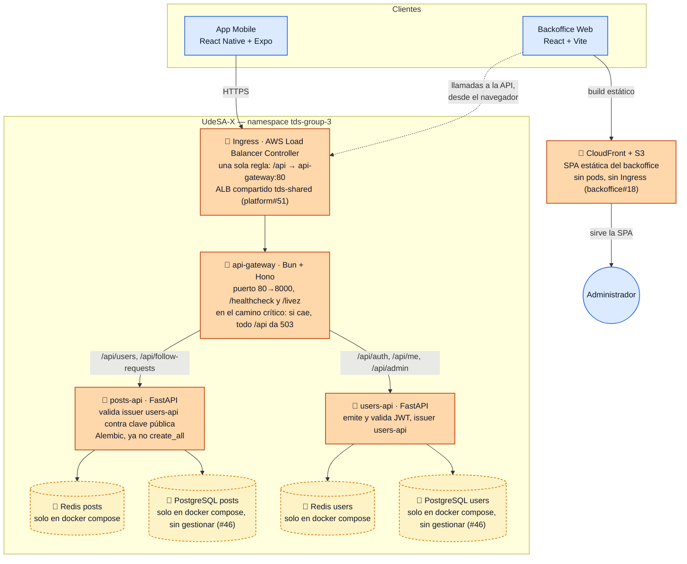
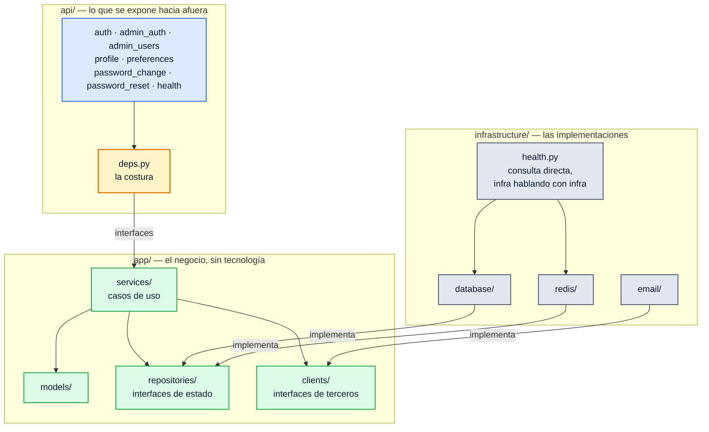

# Diagramas C4 de UdeSA-X

Primera versión, `T-50`. Tres niveles: Contexto, Contenedores y Componentes. Sin Nivel 4: casi
nunca aporta, y menos en un sistema de este tamaño.

En Mermaid con `flowchart` genérico, no con la sintaxis nativa `C4Context`/`C4Container`: esa
sigue siendo experimental, con huecos en tags, leyendas y layout. `flowchart` es también lo que
usa el resto de los diagramas de `ARQUITECTURA.md`, y mantiene un solo estilo visual en el
repositorio.

Cada nivel cierra con una nota de qué muestra y qué deja afuera.

## Nivel 1 — Contexto

Quiénes usan el sistema y con qué sistemas externos habla, sin entrar en qué hay adentro.

**Qué muestra:** la arquitectura objetivo completa, tal como la compromete la consigna. Los
cuatro sistemas externos son el diseño final; el estado de cada integración está en el Nivel 2.
**Qué deja afuera:** cómo está construido `UdeSA-X` por dentro (Nivel 2) y las decisiones de
infraestructura — cluster, bases, colas —, documentadas en `ARQUITECTURA.md` y el ADR-008.

## Nivel 2 — Contenedores

Estado al 20 de septiembre, en tres grupos:

- ✅ **En `main`, corriendo en desarrollo local.**
- 🔧 **En Pull Request, probado con imágenes reales, sin mergear todavía.** `platform#51`,
  `users-api#42`, `posts-api#37`, `api-gateway#3` y `backoffice#18` forman un conjunto
  coordinado: login y perfil a través del gateway responden `200`, `follow` responde `204` con
  el JWT correcto y `401` sin el issuer esperado, y `/api/follow-requests` responde `200` a
  través del gateway. Mergear estas PR no despliega nada por sí solo: falta la aprobación del
  tutor, el acceso a AWS (bloqueado en `#47`) y que el docente aplique
  `namespace.yaml`/`ingress.yaml`.
- 🚧 **Sin empezar.** Bases de datos gestionadas (`#46`): hoy solo existen en `docker compose`.

`backoffice` no se sirve a través del `Ingress`. Es una SPA: el build estático se publica en un
bucket S3 y CloudFront lo sirve por HTTPS, sin `k8s/` ni pods propios. Lo único que cruza el
`Ingress` es el tráfico que el JavaScript ya cargado en el navegador del administrador le hace a
la API (`VITE_API_URL`, fijada en build time). `mobile`, sin un paso de "servido" intermedio,
habla directo con el `Ingress` desde la app instalada.

`users-api` y `posts-api` no tienen ninguna llamada síncrona entre sí. Cada uno verifica el JWT
por su cuenta contra la clave pública Ed25519 de `users-api`, validando también el `issuer`
(`users-api#42`, `posts-api#37`); `posts-api` no tiene un cliente HTTP entre sus dependencias.

**Qué muestra:** los cuatro servicios de aplicación que existen en código hoy, con su estado real
en `main` y en las PR abiertas. **Qué deja afuera:** `notifications-api`, RabbitMQ y MongoDB —
sin código todavía (`T-03`, S7) —, que aparecen en la arquitectura objetivo de `ARQUITECTURA.md`
pero no acá; y la configuración de detalle (`ResourceQuota`, `LimitRange`, las annotations del
`Ingress` que fija la cátedra), que no es un contenedor.

## Nivel 3 — Componentes de `users-api`

Solo `users-api`, el único servicio con estructura de capas madura (`ADR-007`). `posts-api` y
`api-gateway` no tienen esa forma todavía, o no la necesitan.

`api/deps.py` es el único módulo que conoce las implementaciones concretas: decide, al arrancar
la app, qué clase de `infrastructure/` satisface cada interfaz de `app/repositories` y
`app/clients`. La regla del `ADR-007` es verificable por import: `app/` no importa nada de `api/`
ni de `infrastructure/`, e `infrastructure/` implementa lo que `app/` declara, nunca al revés.

**Qué muestra:** las tres capas reales de `users-api` y el sentido único de sus dependencias.
**Qué deja afuera:** los ocho archivos de `api/` con sus esquemas de entrada y salida —cubiertos
por la documentación interactiva en `/docs` de cada servicio—, `config/` —una sola clase
`Settings`, sin relaciones que dibujar—, y el detalle de los otros tres servicios.

## Referencias

- `ARQUITECTURA.md` — arquitectura objetivo y decisiones de stack
- `docs/adr/ADR-007-estructura-por-capas.md` — estructura de `users-api`
- `docs/adr/ADR-008-plataforma-de-despliegue.md` — el cluster compartido de la cátedra
