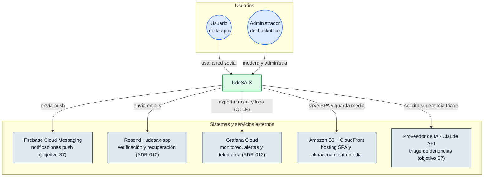
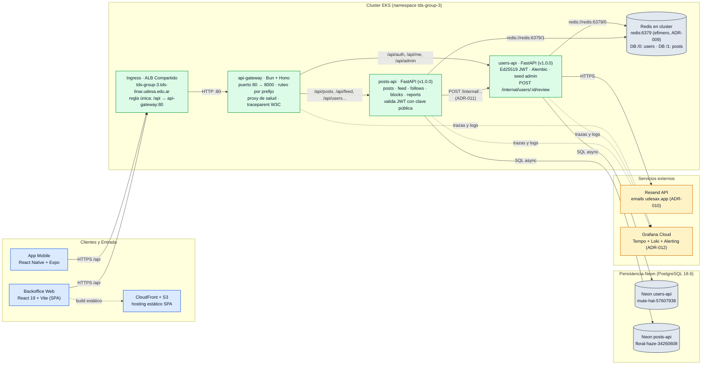
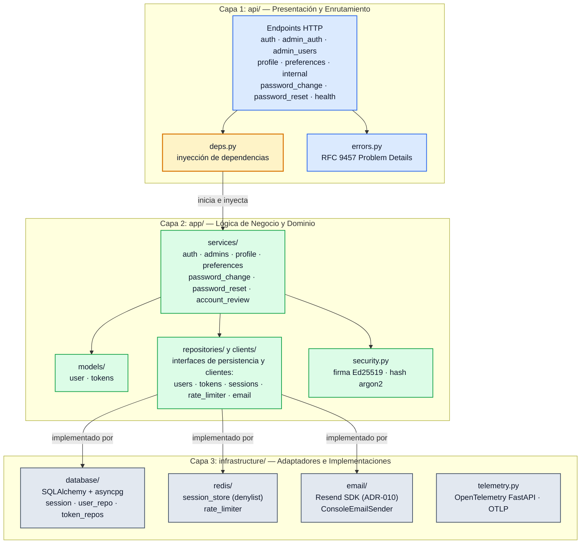
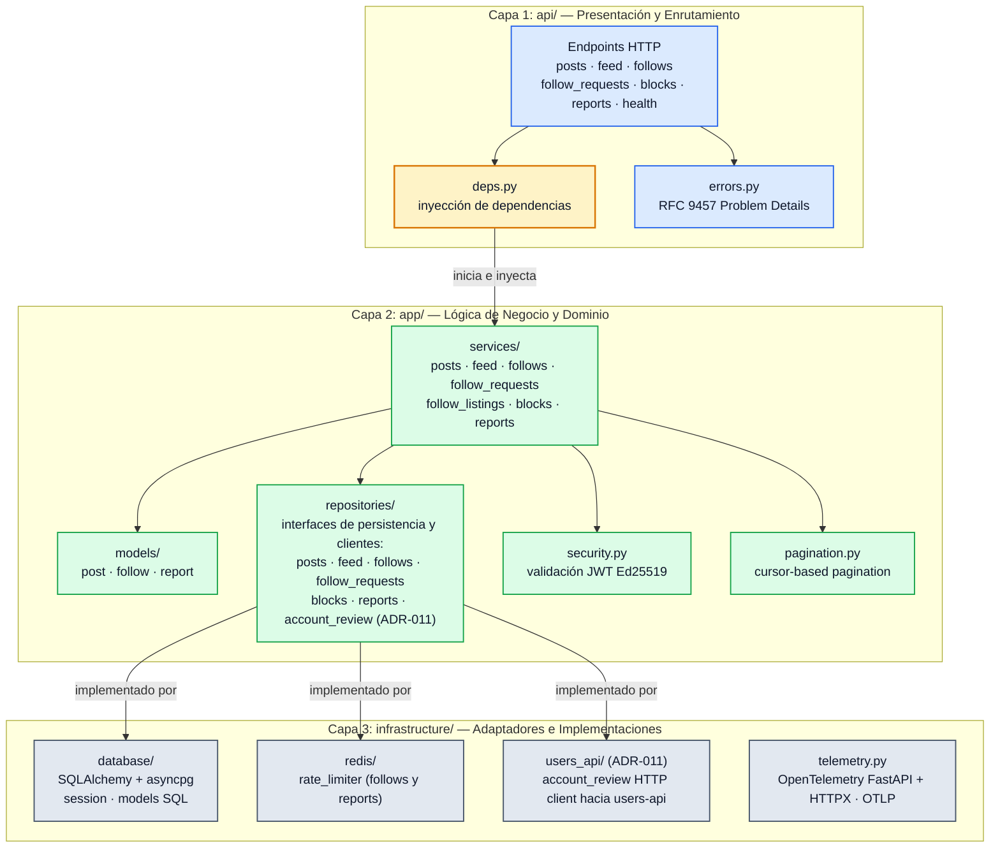

# Diagramas C4 de UdeSA-X

Actualizado a octubre de 2026 (post-entrega intermedia, versión `1.0.0` desplegada). Tres niveles:
Contexto, Contenedores y Componentes. Sin Nivel 4: casi nunca aporta, y menos en un sistema de
este tamaño.

En Mermaid con `flowchart` genérico, no con la sintaxis nativa `C4Context`/`C4Container`: esa
sigue siendo experimental, con limitaciones en tags, leyendas y layout. `flowchart` es también lo
que usa el resto de los diagramas de `ARQUITECTURA.md`, manteniendo un solo estilo visual en todo
el repositorio.

Cada nivel cierra con una nota de qué muestra y qué deja afuera.

## Nivel 1 — Contexto

Quiénes usan el sistema y con qué sistemas externos interactúa, organizado con flujo jerárquico
descendente (usuarios arriba, sistema al centro y dependencias externas abajo) para evitar cruces
de líneas.

```mermaid
flowchart TB
    subgraph actores["Usuarios"]
        direction LR
        USR(("Usuario<br/>de la app"))
        ADM(("Administrador<br/>del backoffice"))
    end

    SYS["UdeSA-X"]

    subgraph externos["Sistemas y servicios externos"]
        direction LR
        FCM["Firebase Cloud Messaging<br/>notificaciones push (objetivo S7)"]
        RESEND["Resend · udesax.app<br/>verificación y recuperación (ADR-010)"]
        GRAF["Grafana Cloud<br/>monitoreo, alertas y telemetría (ADR-012)"]
        S3["Amazon S3 + CloudFront<br/>hosting SPA y almacenamiento media"]
        IA["Proveedor de IA · Claude API<br/>triage de denuncias (objetivo S7)"]
    end

    USR -->|"usa la red social"| SYS
    ADM -->|"modera y administra"| SYS

    SYS -->|"envía push"| FCM
    SYS -->|"envía emails"| RESEND
    SYS -->|"exporta trazas y logs (OTLP)"| GRAF
    SYS -->|"sirve SPA y guarda media"| S3
    SYS -->|"solicita sugerencia triage"| IA

    classDef persona fill:#dbeafe,stroke:#2563eb,stroke-width:1.5px,color:#0f172a
    classDef sistema fill:#dcfce7,stroke:#16a34a,stroke-width:2px,color:#0f172a
    classDef externo fill:#e2e8f0,stroke:#475569,stroke-width:1.5px,color:#0f172a
    class USR,ADM persona
    class SYS sistema
    class FCM,RESEND,GRAF,S3,IA externo
```

**Qué muestra:** los usuarios reales y los sistemas externos con los que el ecosistema se conecta.
Incluye tanto los servicios externos integrados en producción (Resend con dominio `udesax.app`
según ADR-010; Grafana Cloud para telemetría OTLP, monitoreo sintético y alerta de caídas por email
según ADR-012; S3 y CloudFront para hosting y media) como las integraciones objetivo de la
segunda etapa (FCM y Claude API).
**Qué deja afuera:** la arquitectura interna de `UdeSA-X` (desglosada en el Nivel 2) y la topología
de red de Kubernetes (`ARQUITECTURA.md`, ADR-008 y ADR-009).

---

## Nivel 2 — Contenedores

Organizado de izquierda a derecha (`flowchart LR`) siguiendo el camino natural del tráfico
HTTP: clientes a la izquierda, Ingress y API Gateway al centro, microservicios procesando y
comunicándose, y almacenamiento/servicios externos a la derecha. Este flujo lineal elimina los
bucles hacia arriba y los cruces de líneas de la topología en estrella.

- ✅ **Desplegado y productivo en AWS EKS / CloudFront.** Los servicios de backend (`api-gateway`,
  `users-api`, `posts-api`), el Redis efímero dentro del cluster, el Ingress compartido, las bases
  gestionadas en Neon y la SPA del backoffice en S3 + CloudFront están 100% operativos.
- 🚧 **Objetivo para S7 en adelante.** `notifications-api` (NestJS), broker de eventos RabbitMQ,
  MongoDB Atlas para notificaciones y triage automático con IA.

```mermaid
flowchart LR
    subgraph clientes["Clientes y Entrada"]
        direction TB
        MOB["App Mobile<br/>React Native + Expo"]
        BO["Backoffice Web<br/>React 19 + Vite (SPA)"]
        CDN["CloudFront + S3<br/>hosting estático SPA"]
        BO -.->|"build estático"| CDN
    end

    subgraph k8s["Cluster EKS (namespace tds-group-3)"]
        ING["Ingress · ALB Compartido<br/>tds-group-3.tds-linar.udesa.edu.ar<br/>regla única: /api → api-gateway:80"]
        GW["api-gateway · Bun + Hono<br/>puerto 80 → 8000 · ruteo por prefijo<br/>proxy de salud · traceparent W3C"]
        
        ING -->|"HTTP :80"| GW

        USR["users-api · FastAPI (v1.0.0)<br/>Ed25519 JWT · Alembic · seed admin<br/>POST /internal/users/:id/review"]
        PST["posts-api · FastAPI (v1.0.0)<br/>posts · feed · follows · blocks · reports<br/>valida JWT con clave pública"]
        RED[("Redis en cluster<br/>redis:6379 (efímero, ADR-009)<br/>DB /0: users · DB /1: posts")]

        GW -->|"/api/auth, /api/me, /api/admin"| USR
        GW -->|"/api/posts, /api/feed, /api/users..."| PST
        PST -->|"POST /internal/...<br/>(ADR-011)"| USR

        USR -->|"redis://redis:6379/0"| RED
        PST -->|"redis://redis:6379/1"| RED
    end

    subgraph datos["Persistencia Neon (PostgreSQL 18.6)"]
        direction TB
        NEON_U[("Neon users-api<br/>mute-hat-57607938")]
        NEON_P[("Neon posts-api<br/>floral-haze-34260608")]
    end

    subgraph externos["Servicios externos"]
        direction TB
        RESEND["Resend API<br/>emails udesax.app (ADR-010)"]
        GRAFANA["Grafana Cloud<br/>Tempo + Loki + Alerting (ADR-012)"]
    end

    MOB -->|"HTTPS /api"| ING
    BO -->|"HTTPS /api"| ING

    USR -->|"SQL async"| NEON_U
    PST -->|"SQL async"| NEON_P
    USR -->|"HTTPS"| RESEND

    GW -.->|"trazas y logs"| GRAFANA
    USR -.->|"trazas y logs"| GRAFANA
    PST -.->|"trazas y logs"| GRAFANA

    classDef cliente fill:#dbeafe,stroke:#2563eb,stroke-width:1.5px,color:#0f172a
    classDef listo fill:#dcfce7,stroke:#16a34a,stroke-width:1.5px,color:#0f172a
    classDef store fill:#e2e8f0,stroke:#475569,stroke-width:1.5px,color:#0f172a
    classDef externo fill:#fef3c7,stroke:#d97706,stroke-width:1.5px,color:#0f172a
    class MOB,BO,CDN cliente
    class ING,GW,USR,PST listo
    class RED,NEON_U,NEON_P store
    class RESEND,GRAFANA externo
```

### Detalles operativos de los contenedores

1. **Backoffice**: SPA compilada con React 19 + Vite. Se publica en un bucket privado de S3 y
   CloudFront la distribuye globalmente por HTTPS. No utiliza pods ni consume cuota de Kubernetes.
   El navegador del administrador realiza llamadas REST directas al Ingress bajo el prefijo `/api`
   (`VITE_API_URL`).
2. **App Mobile**: React Native + Expo. Los clientes instalados se comunican directamente con el
   Ingress sobre HTTPS (`EXPO_PUBLIC_API_URL`).
3. **Ingress y api-gateway**: La entrada al cluster la provee el AWS Load Balancer Controller con un
   Application Load Balancer compartido (`tds-shared`). La regla única rutea todo `/api` hacia el
   `api-gateway` (puerto 80 → 8000). El gateway resuelve los destinos según el prefijo de la ruta,
   reescribe el header `Host`, inyecta el encabezado `traceparent` de OpenTelemetry y delega la
   respuesta upstream.
4. **Salud centralizada y alertas**: El gateway expone `/api/health/:service`, consultando el
   `/healthcheck` privado de cada backend con un timeout estricto de 5 segundos. Synthetic
   Monitoring de Grafana Cloud sondea estos endpoints cada 2 minutos y dispara alertas automáticas
   por email a los administradores ante caídas de servicio (ADR-012).
5. **Comunicación interna entre microservicios**:
   - `users-api` y `posts-api` son autónomos para validar tokens JWT: cada uno verifica la firma
     usando la clave pública Ed25519 de `users-api` y comprueba el `issuer` esperado sin realizar
     llamadas de red. La revocación la consulta `posts-api` en el Redis de `users-api` (base `/0`,
     solo lectura, falla cerrado; ADR-014).
   - La **única llamada síncrona REST** entre microservicios ocurre cuando una cuenta supera el
     umbral de 6 denunciantes únicos (ADR-011): `posts-api` invoca vía `httpx` al endpoint interno
     `POST /internal/users/{id}/review` de `users-api` usando el DNS interno del cluster
     (`http://users-api`). Esta ruta no pasa por el gateway ni está expuesta en el Ingress, y se
     autentica con un secreto compartido en el header `X-Internal-Token`.
6. **Bases de datos y caché**:
   - PostgreSQL reside en dos proyectos independientes de Neon (PostgreSQL 18.6) con cifrado TLS
     estricto (`ssl=verify-full`, `PGSSLROOTCERT`). Los cambios de esquema se aplican
     exclusivamente con Alembic mediante Kubernetes Jobs previos al despliegue de los pods.
   - Redis corre dentro del namespace en un único pod efímero (`k8s/redis.yaml`, Redis 8-alpine,
     sin PVC ni persistencia en disco, política `noeviction` con límite de memoria de 192 MB).
     `users-api` opera sobre la base lógica `/0` y `posts-api` sobre `/1`, y además lee de `/0`
     las marcas de revocación de sesión (ADR-014).

**Qué muestra:** los contenedores reales y desplegados en producción con su flujo de datos,
protocolos, puertos y servicios externos asociados.
**Qué deja afuera:** `notifications-api`, RabbitMQ y MongoDB Atlas (componentes de la arquitectura
objetivo para la segunda entrega, sin código en `main` todavía).

---

## Nivel 3 — Componentes de los microservicios

Tanto `users-api` como `posts-api` adoptan una arquitectura en capas limpias con inversión de
dependencias (`ADR-006` y `ADR-007`).

Los diagramas están estructurados en capas estrictamente secuenciales de arriba hacia abajo:
1. **Capa 1: `api/`** (Presentación, controladores y wiring).
2. **Capa 2: `app/`** (Reglas de negocio, servicios, modelos de dominio e interfaces de repositorios/clientes).
3. **Capa 3: `infrastructure/`** (Adaptadores técnicos concretos que implementan las interfaces).

Esta orientación unidireccional vertical garantiza líneas limpias, rectas y sin bifurcaciones
cruzadas.

### Componentes de `users-api`

```mermaid
flowchart TB
    subgraph api["Capa 1: api/ — Presentación y Enrutamiento"]
        direction LR
        ENDPOINTS["Endpoints HTTP<br/>auth · admin_auth · admin_users<br/>profile · preferences · internal<br/>password_change · password_reset · health"]
        DEPS["deps.py<br/>inyección de dependencias"]
        ERRORS["errors.py<br/>RFC 9457 Problem Details"]
        ENDPOINTS --> DEPS
        ENDPOINTS --> ERRORS
    end

    subgraph app["Capa 2: app/ — Lógica de Negocio y Dominio"]
        SERVICES["services/<br/>auth · admins · profile · preferences<br/>password_change · password_reset · account_review"]
        MODELS["models/<br/>user · tokens"]
        REPOS["repositories/ y clients/<br/>interfaces de persistencia y clientes:<br/>users · tokens · sessions · rate_limiter · email"]
        SEC["security.py<br/>firma Ed25519 · hash argon2"]
        SERVICES --> MODELS
        SERVICES --> SEC
        SERVICES --> REPOS
    end

    subgraph infra["Capa 3: infrastructure/ — Adaptadores e Implementaciones"]
        direction LR
        DB["database/<br/>SQLAlchemy + asyncpg<br/>session · user_repo · token_repos"]
        REDIS_INFRA["redis/<br/>session_store (denylist)<br/>rate_limiter"]
        EMAIL["email/<br/>Resend SDK (ADR-010)<br/>ConsoleEmailSender"]
        TELEMETRY["telemetry.py<br/>OpenTelemetry FastAPI · OTLP"]
    end

    DEPS -->|"inicia e inyecta"| SERVICES
    REPOS -->|"implementado por"| DB
    REPOS -->|"implementado por"| REDIS_INFRA
    REPOS -->|"implementado por"| EMAIL

    classDef capaApi fill:#dbeafe,stroke:#2563eb,stroke-width:1.5px,color:#0f172a
    classDef capaApp fill:#dcfce7,stroke:#16a34a,stroke-width:1.5px,color:#0f172a
    classDef capaInfra fill:#e2e8f0,stroke:#475569,stroke-width:1.5px,color:#0f172a
    classDef costura fill:#fef3c7,stroke:#d97706,stroke-width:2px,color:#0f172a
    class ENDPOINTS,ERRORS capaApi
    class MODELS,REPOS,SERVICES,SEC capaApp
    class DB,REDIS_INFRA,EMAIL,TELEMETRY capaInfra
    class DEPS costura
```

`api/deps.py` actúa como la raíz de composición: resuelve e inyecta las instancias de
`infrastructure/` que satisfacen los repositorios y clientes que `app/services` requiere.
`internal.py` expone `POST /internal/users/{id}/review`, que invoca `account_review.py` para cambiar
el estado del usuario a `in_review` y revocar sus credenciales activas en Redis.

---

### Componentes de `posts-api`

```mermaid
flowchart TB
    subgraph api["Capa 1: api/ — Presentación y Enrutamiento"]
        direction LR
        ENDPOINTS["Endpoints HTTP<br/>posts · feed · follows<br/>follow_requests · blocks · reports · health"]
        DEPS["deps.py<br/>inyección de dependencias"]
        ERRORS["errors.py<br/>RFC 9457 Problem Details"]
        ENDPOINTS --> DEPS
        ENDPOINTS --> ERRORS
    end

    subgraph app["Capa 2: app/ — Lógica de Negocio y Dominio"]
        SERVICES["services/<br/>posts · feed · follows · follow_requests<br/>follow_listings · blocks · reports"]
        MODELS["models/<br/>post · follow · report"]
        REPOS["repositories/<br/>interfaces de persistencia y clientes:<br/>posts · feed · follows · follow_requests<br/>blocks · reports · account_review (ADR-011)"]
        SEC["security.py<br/>validación JWT Ed25519"]
        PAG["pagination.py<br/>cursor-based pagination"]
        SERVICES --> MODELS
        SERVICES --> SEC
        SERVICES --> PAG
        SERVICES --> REPOS
    end

    subgraph infra["Capa 3: infrastructure/ — Adaptadores e Implementaciones"]
        direction LR
        DB["database/<br/>SQLAlchemy + asyncpg<br/>session · models SQL"]
        REDIS_INFRA["redis/<br/>rate_limiter (follows y reports)"]
        USERS_CLIENT["users_api/ (ADR-011)<br/>account_review HTTP client hacia users-api"]
        TELEMETRY["telemetry.py<br/>OpenTelemetry FastAPI + HTTPX · OTLP"]
    end

    DEPS -->|"inicia e inyecta"| SERVICES
    REPOS -->|"implementado por"| DB
    REPOS -->|"implementado por"| REDIS_INFRA
    REPOS -->|"implementado por"| USERS_CLIENT

    classDef capaApi fill:#dbeafe,stroke:#2563eb,stroke-width:1.5px,color:#0f172a
    classDef capaApp fill:#dcfce7,stroke:#16a34a,stroke-width:1.5px,color:#0f172a
    classDef capaInfra fill:#e2e8f0,stroke:#475569,stroke-width:1.5px,color:#0f172a
    classDef costura fill:#fef3c7,stroke:#d97706,stroke-width:2px,color:#0f172a
    class ENDPOINTS,ERRORS capaApi
    class MODELS,REPOS,SERVICES,SEC,PAG capaApp
    class DB,REDIS_INFRA,USERS_CLIENT,TELEMETRY capaInfra
    class DEPS costura
```

`posts-api` implementa el cliente `UsersApiAccountReviewClient` en `infrastructure/users_api/`
como una implementación de la interfaz `AccountReviewRepository` declarada en `app/`. Cuando
`reports.py` registra una sexta denuncia única sobre una cuenta, este cliente realiza la llamada
HTTP hacia `users-api` con el header `X-Internal-Token` propagando el contexto de telemetría
(traceparent).

---

### Estructura de `api-gateway` y `backoffice`

- **api-gateway** (Bun + Hono):
  - `routing.ts`: tabla declarativa de prefijos (`/api/auth`, `/api/me`, `/api/admin` hacia `users-api`; `/api/users`, `/api/follow-requests`, `/api/posts`, `/api/feed`, `/api/blocks`, `/api/reports` hacia `posts-api`) y mapeo de `HEALTH_TARGETS`.
  - `telemetry.ts`: middleware de observabilidad OpenTelemetry que genera o propaga el `trace_id` e inyecta encabezados W3C `traceparent` a las llamadas upstream.
  - `app.ts`: enrutador Hono con reverse proxy HTTP, timeout de 5 segundos en chequeos de salud `/api/health/:service`, y endpoints locales `/healthcheck` y `/livez`.
- **backoffice** (React 19 + Vite):
  - `features/`: módulos funcionales desacoplados (`auth`, `users`, `health`, `moderation`, `dashboard`).
  - `services/apiClient.ts`: cliente Axios con interceptor de bearer token, timeout de 10s y parseo unificado de RFC 9457 Problem Details (`toApiError`).
  - `stores/authStore.ts`: store Zustand para gestión de sesión y credenciales.

---

## Referencias

- `docs/ARQUITECTURA.md` — arquitectura objetivo y decisiones de stack
- `docs/adr/ADR-005-limites-de-servicios.md` — distribución de responsabilidades
- `docs/adr/ADR-006-inversion-de-dependencias.md` — desacoplamiento de capas
- `docs/adr/ADR-007-estructura-por-capas.md` — arquitectura limpia en microservicios
- `docs/adr/ADR-008-plataforma-de-despliegue.md` — cluster compartido EKS
- `docs/adr/ADR-009-bases-gestionadas-y-migraciones.md` — Neon PostgreSQL y Redis en cluster
- `docs/adr/ADR-010-proveedor-de-correo.md` — Resend con dominio `udesax.app`
- `docs/adr/ADR-011-denuncias-y-cuenta-en-revision.md` — llamada síncrona interna posts-api → users-api
- `docs/adr/ADR-012-monitoreo-de-servicios-y-alerta-de-caida.md` — Grafana Cloud Synthetic Monitoring y Alerting
- `docs/adr/ADR-014-revocacion-de-sesiones-en-posts-api.md` - posts-api lee las marcas de revocación del Redis de users-api
